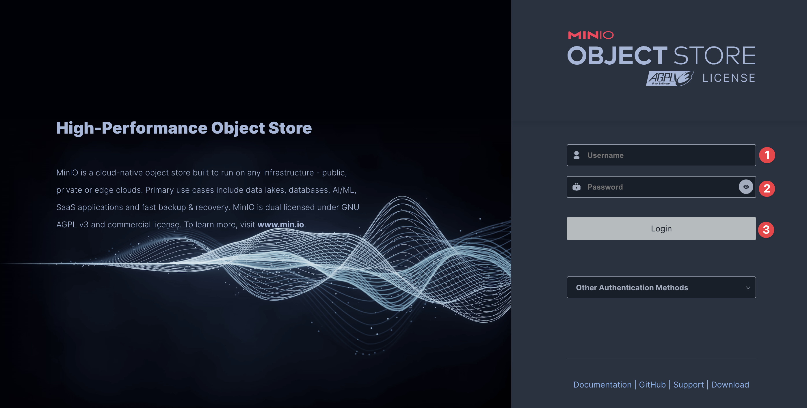
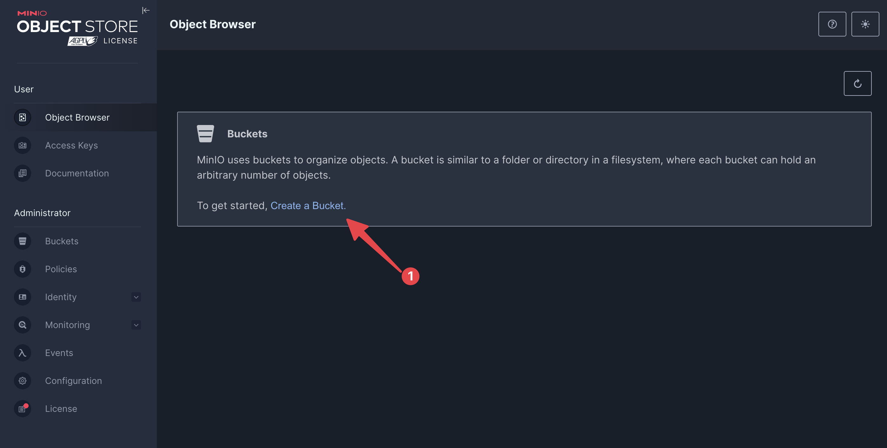
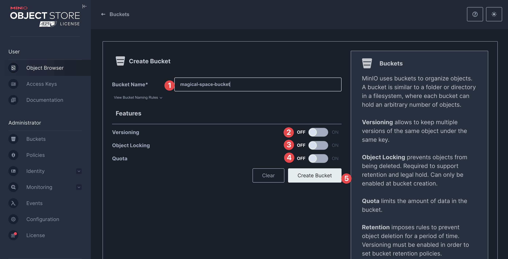
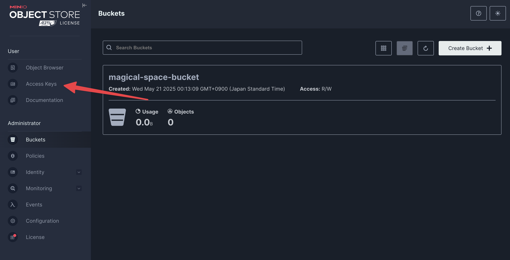
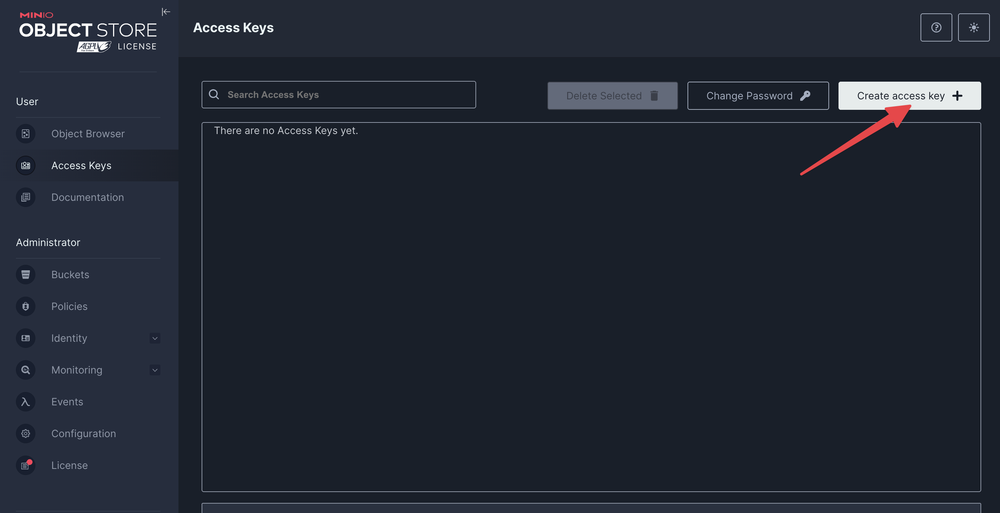
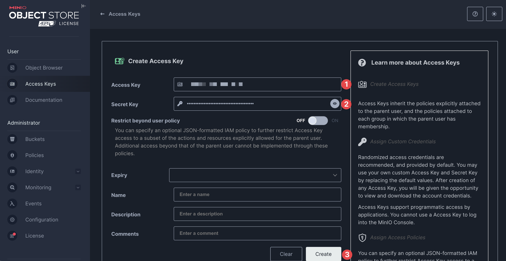
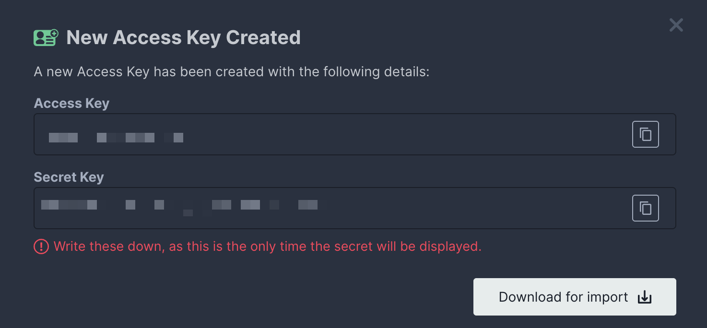

# MinIO Setup Guide

## Overview

For local development, we use Amazon S3-compatible object storage. [MinIO](https://min.io/) is a free, high-performance, S3-compatible object storage server that runs locally via Docker. This allows you to develop and test without needing an AWS account or incurring any costs.

## Starting MinIO

Before proceeding with your project, start MinIO to create a bucket and generate access credentials.

From the root of this project, run:

```sh
docker-compose -f .devcontainer/docker-compose.common.yml up minio -d
```

This command starts MinIO as a background service. Once running, access the MinIO web interface at:

```
http://localhost:9001
```

## Initial Setup

### Logging In

Open your browser and navigate to `http://localhost:9001`. You’ll see the MinIO login screen:



- **Username:** `minioadmin`
- **Password:** `minioadmin`

Enter these credentials and click **Login**.

### Creating a Bucket

After logging in, you’ll see the bucket list screen:



1. Click the **Create Bucket** button (marked `1` in the image).
2. In the next screen:

    

    - Enter a name for your bucket at point `1`.
    - Leave options `2`, `3`, and `4` disabled (these are optional for development).
    - Click **Create Bucket** (point `5`).

### Creating Access and Secret Keys

To allow your API to access the bucket, you need to create an Access Key and Secret Key.

1. After creating the bucket, click the **Access Keys** link in the navigation bar:

    

2. The Access Keys list will appear (likely empty):

    

3. Click **Create access key +**.

4. In the creation screen:

    

    - The **Access Key** (point `1`) is public.
    - The **Secret Key** (point `2`) is private.
    - Click **Create** (point `3`).

5. Your new Access Key and Secret Key will be displayed:

    

### Updating Your `.env` File

Add the following to your `.env` file in this repository:

- `S3_ACCESS_KEY`: Your MinIO Access Key
- `S3_SECRET_KEY`: Your MinIO Secret Key
- `S3_BUCKET`: The name of the bucket you created

This will configure your project to use the local MinIO instance for object storage during development.